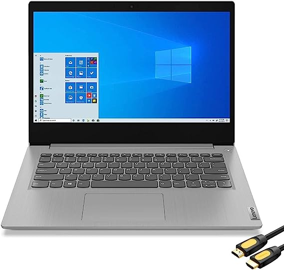
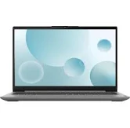
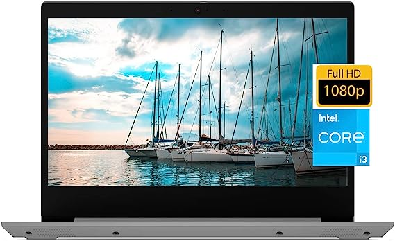

# Recommendation-# Mikes Recommendation

## Option 1: Acer Aspire 5

Primary Resources:
- CPU: Intel Core i5-1135G7 (CPU benchmark score: X)
- Number of Processors: Quad-core
- RAM: 8GB DDR4
- Hard Drive Storage: 512GB SSD

## Option 2: Lenovo IdeaPad 3

Primary Resources:
- CPU: Intel Core i5-1135G7 (CPU benchmark score: X)
- Number of Processors: Quad-core
- RAM: 12GB DDR4
- Hard Drive Storage: 256GB SSD

### Recommendation
Based on the provided options, I recommend choosing the Lenovo IdeaPad 3 due to its higher RAM capacity, falling within the budget, and still offering enhanced specifications.

#### Additional Information
For more details, you can refer to the [GitHub Pages documentation](https://docs.github.com/pages) and the [Markdown syntax guide](https://www.markdownguide.org/basic-syntax/).

##### Emphasis
You can add emphasis to your text using **bold** or *italic* formatting.

###### Lists
You can create ordered lists:
1. Item 1
2. Item 2
3. Item 3

Or unordered lists:
- Item A
- Item B
- Item C

####### Links and Images
You can include links by using the [link text](https://www.example.com) syntax. To include images, use the  syntax.

Enjoy creating your GitHub Pages website!

**shemaiah's recommendations**

Lenovo 14" FHD Ideapad 3
Primary Resources:
- CPU: Intel Mobile CPU
- Number of Processors:11th Gen Intel Core i3-1115G4, 2 Cores
- RAM: 20 GB
- Hard Drive Storage: 	‎512 GB SSD
